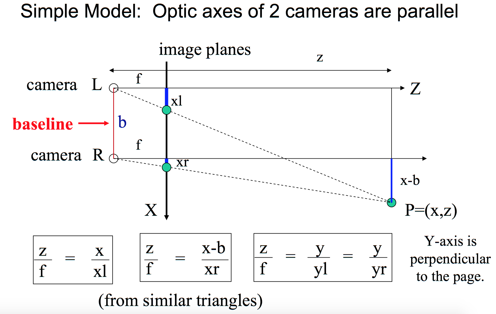
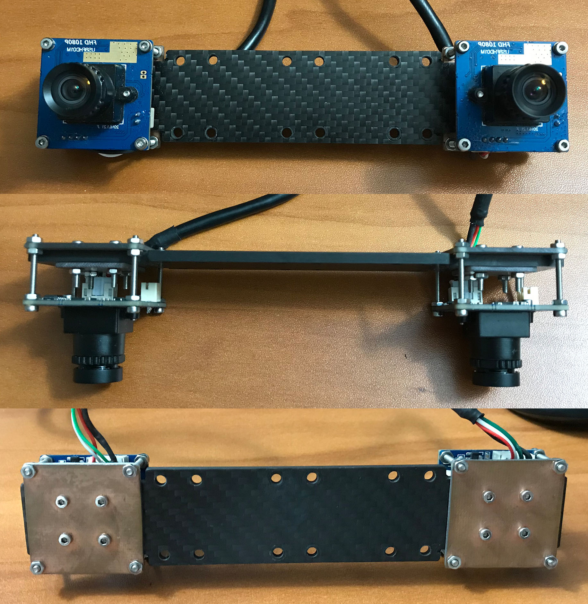
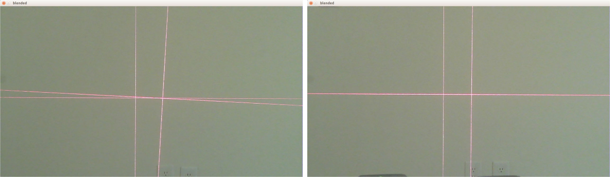
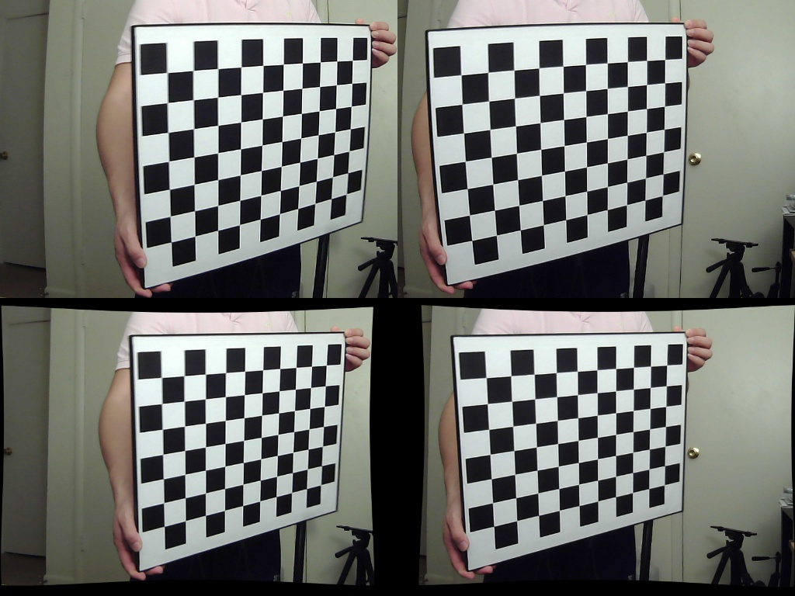
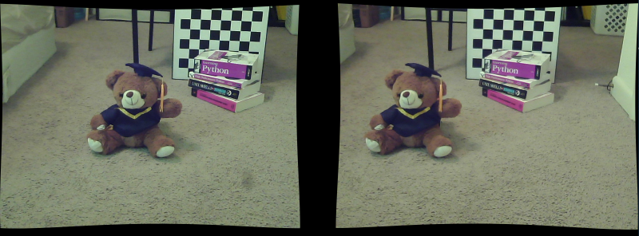
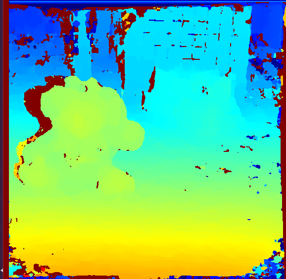

# Stereo Vision Camera
## 1. DESCRIPTION
Stereo vision camera is widely used in depth detection and 3D reconstruction on a varies of places, such as UAVs and other robotics. In this project, I build a stereo vision camera system using two USB cameras which work with v4l2 standards. The is project contains the hardware built procedure, camera optical axis alignment method, image rectification procedure, and the real time depth map generation method.

## 2. THEORY OF STEREO VISION
If the images of an object are captured from two different points of view, the 3D information can be derived from the disparity of the two images. We use a pinhole camera model to illustrate the theory of stereovision. Figure one is a stereovision system with two parallel cameras. The object point P is projected on the image plane of the two cameras. For left and right cameras, the position of image points of P is different. The xl is the distance between left camera axis and image of P on left camera image plane, and xr is the distance between the optical axis of right camera and image point of P on right camera image plane. f is the focal length of the two cameras. The distance between two optical axes is called baseline(b). It is notable that the length of xl and xr are different. The boxes equations are obtained from similar triangles. From these relations, the location of the 3D points in object space can be derived.
- (1) 𝑧 = (𝑓∙𝑏) / (𝑥𝑙 − 𝑥𝑟) = (𝑓∙𝑏) / 𝑑  
- (2) 𝑥 = 𝑥 𝑙 ∙ (𝑧/𝑓)  
- (3) 𝑦 = 𝑦 𝑙 ∙ (𝑧/𝑓)  

The difference between xr and xl is called disparity. Eqn. (1) shows that the depth z is inversely proportional to disparity. This method of determining depth z from disparity d is called triangulation.

## 3. HARDWARE CONFIGURATION
### 1) Stereo Vision Camera
I designed a stereo vision camera mount to install two camera modules on it. The pitch, yaw, and roll of the board camera module are adjustable. The plate connecting two cameras is made of carbon fiber, which is a rigid material resistanting bent.

### 2) Board Camera Module
ELP-USBFHD01M-FV board camera.

### 3) Baseline
Baseline = 120mm

The baseline is the distance between two camera’s optical axes. A short baseline stereovision system has larger overlapped visual area, which is able to detect the objects close to the camera. But the disparities at larger distance are too small to be distinguished. A larger baseline system has a larger detection range, but cannot detect the object that is close to camera. Besides that, the larger baseline system has to searching the larger range when execute the stereo matching algorithm, which needs more time and hardware resource, meanwhile, the mismatching probability will increase. It is important to choose a proper baseline to meet a specific requirement. The 12cm baseline system has a working range from 1m to 10m. This working range satisfies the requirement of a drone.

### 4) Focal Length
Focal Length = 4.35mm low distortion lens

The focal length is the distance between the lens and the image sensor when the subject is in focus. The short focal length lens has a large view angle, but will produce large distortion. The long focal length lens has a narrow view angle, but the distortion is small. The distortion will drastically reduce the accuracy of the depth map. A drone needs the large angle view to acquire a big scene of the environment, at the same time, it require an accurate depth map to get position information. In this project, we use 4.35mm low distortion lens.

### 5) Supported Frame Format
Pixel Format : MJPG  
- 1) discrete 1920x1080 ( 30 fps) # Good. FPS=10.24. decode_time=58ms. Full hardward resolution. Largest view angle.
- 2) discrete 1280x1024 ( 30 fps) # Good. FPS=15.66. decode_time=40ms. View angel is slightly larger than 320X240
- 3) discrete 1280x720  ( 60 fps) # Good. FPS=23.23. decode_time=27ms. View angel is equal to 320X240
- 4) discrete 1024x768  ( 30 fps) # Dark. FPS=26.50. decode_time=22ms. View angel is slightly larger than 320X240
- 5) discrete  800x600  ( 60 fps) # Good. FPS=38.64. decode_time=17ms. Very Narrow.
- 6) discrete  640x480  (120 fps) # Dark. FPS=58.74. decode_time=11ms. View angel is equal to 320X240
- 7) discrete  320x240  (120 fps) # Good. FPS=99.14. decode_time= 3ms. 

Pixel Format : YUYV
- 1) discrete 1920x1080 (  6 fps) # FPS= 4.97. decode_time=12 ms.
- 2) discrete 1280x1024 (  6 fps) # FPS= 4.97. decode_time=8.0ms. Narrow.
- 3) discrete 1280x720  (  9 fps) # FPS= 9.21. decode_time=6.5ms.
- 4) discrete 1024x768  (  6 fps) # FPS= 4.96. decode_time=5.5ms. Dark. 
- 5) discrete  800x600  ( 20 fps) # FPS=19.90. decode_time=2.7ms. Narrow.
- 6) discrete  640x480  ( 30 fps) # FPS=29.83. decode_time=1.8ms. View angel is smaller than 320x240.
- 7) discrete  320x240  ( 30 fps) # FPS=29.82. decode_time=0.8ms. View angel is equal to 1920x1080, white ballence differ too much.

To get the real time 3D map in a varying environment, the time resolution is a critical parameter. Because acquiring stereo image pair and calculate depth map need time cost. When the depth map is obtained, the moving objects have changed the position. If the relative velocity of the object to drone is 45km/h (12.5m/s), to achieve a 0.5m spatial resolution, the time interval between two frames of image should be 0.04s. This corresponding frame rate is 25 frames per second (FPS). For a higher speed object, the higher FPS is required.

## 4. SOFTWARE IMPLEMENTATION
This project uses two method to build the software of stereo vision camera system. One method is using the builtin functions in opencv to control the camera hardware. However, upon testing, some camera control functions is not well implemented in opencv. I developed a new software stack working around opencv. I use v4l2 API to control camera hardware directly. The code in folder [stereo_cam_opencv](stereo_cam_opencv/) is developed using opencv functions in python. The code in folder [stereo_cam_v4l2_c](stereo_cam_v4l2_c/) is developed using v4l2 API in c. The c code is a early phase test for v4l2 API, and I only implemented some functions to control camera parameters, no video recording function included. The code in folder [stereo_cam_v4l2_python](stereo_cam_v4l2_python/) is a fully developed package based on v4l2 API. It has camera control, video recording, stereo vision depth map generation functions. 

## 5. USAGE
Before using the stereo vision camera code to create depth map, you need to do camera hardware alignment and software calibration.
### 1) Camera Hardware Alignment.
I developed a cross laser calibration method to calibrate the roll and pitch of two cameras. Please refer to [STEREO VISION CAMERA HARDWARE ALIGNMENT](stereo_cam_hardware_alignment/) for more detail. The following figure shows the mis-aligned \(left\) and in-aligned optical \(right\) axes.

### 2) Stereo Vision Calibration.
I developed a stereo vision calibration workflow based on opencv functions. Please refer to [STEREO CAMERA CALIBRATION](stereo_cam_calibration/README.md) for detailed calibration procedure. The following figure shows the original frame pairs captured by stereo camera \(upper\) and the undistorted, rectified frame pairs to be used to generate depth map.

### 3) Capture Frames and Calculate Depth Map.
Your can either use package [stereo_cam_v4l2_python](stereo_cam_v4l2_python/) or package [stereo_cam_opencv](stereo_cam_opencv/) to capture stereo vision frame pairs and calculate depth map. Please refer to the comment in code for instructions on parameter setting. Following are captured frame pair and the corresponding depth map. In the depth map, the red color means a distance near to camera, and the blue color mean a distance far from the camera. With depth map, we are able to reconstruct the 3D map.

Stereo Vision Camera Frame Pair

Stereo Vision Camera Depth Map

