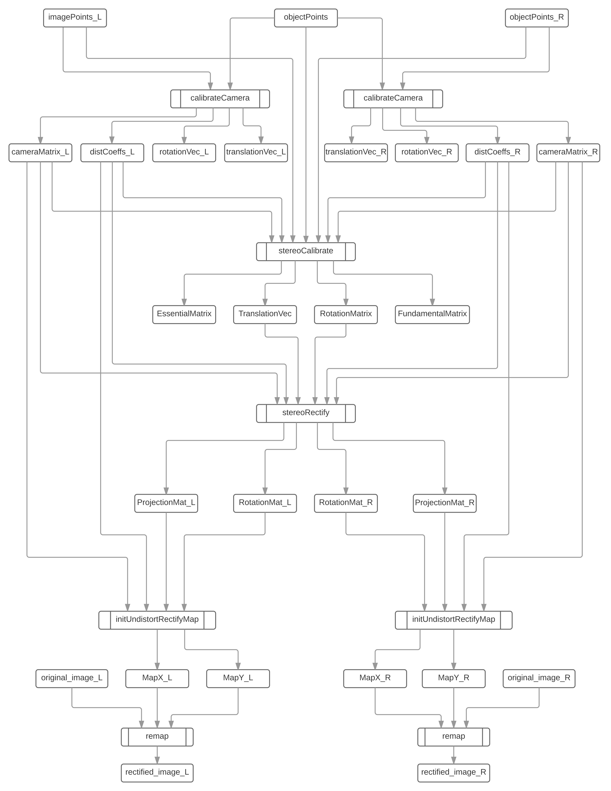

# STEREO CAMERA CALIBRATION

## DESCRIPTION
This is stereo vision camera calibiration tool. It does not only calibrate each individual camera in stereo vision system, but also calibrate the two cameras as a whole system. The Chessborad method is used to rectify frames captured by stereo vision system. 

## PROCEDURE
### 1) Hardware Alignment
To get best result from stereo vision system, the hardware alignment should be done properly before any software calibration. Please refer to [STEREO VISION CAMERA HARDWARE ALIGNMENT](/stereo_cam_hardware_alignment/README.md) to do hardware alignment before use this calibration tool.

### 2) Capture Synchronized Original Frame Pairs.
Use the code capture_synchronized_frame_pair.py to capture frame pairs. You need about 30 or more frame pairs to do calibration. However, you can not guarantee that all frame pairs are good, so you will need to capture more frame pairs, and then select some of high quality.

### 3) Generate Stereo Calibration Remap Parameters
Run generate_stereo_calibration_remap_parameters.py to get remap parapeters. These parameters will be used in the next step to rectify original frames. They can be also used for realtime rectifying. 

### 4) Apply Remap Parameters to Original Frames to Get Rectified Frames.
Run apply_stereo_calibration_remapping.py to get rectified frame. 

## CALIBRATION WORKFLOW
The figure below is the stereo camera calibration workflow using OpenCV. There are five main steps in this workflow. 
- 1) Single camera calibration. The same object sets and two image sets captured by left and right cameras are input into the calibratCamera function. This function will calculate the camera matrix and distortion coefficients for each individual camera.  
- 2) Calculate translation and rotation matrix for stereo camera system. The same object sets and two image sets, as well as the distortion coefficients and camera matrices are input into stereoCalibrate function. This function calculates the translation vector and rotation matrices between the two stereo cameras.  
- 3) Calculate the rectify matrices for each camera. The camera matrices and the distortion coefficients calculated in step 1, and the translation vector and rotation matrix calculated in step 2 are input into stereoRectify function. This function calculates the rotation and projection matrix for each camera.  
- 4) Get remap matrices. The projection matrices and rotation matrices, as well as the camera matrices and distortion coefficients, are input into the initUndistortRectifyMap function. This function outputs two remap matrices for each camera.  
- 5) The original image with the remap matrices are input into remap function to get the rectified stereo image pairs.

