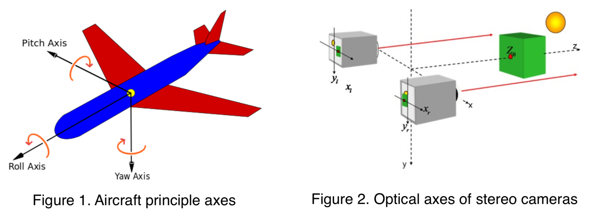
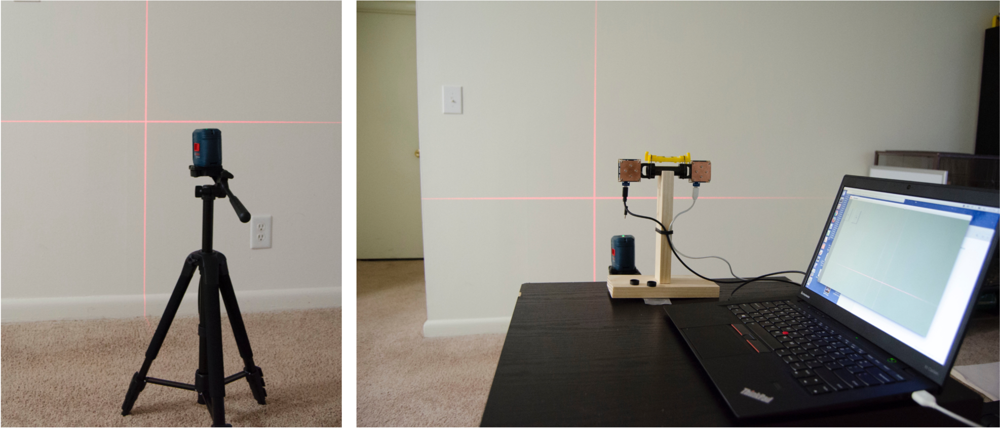
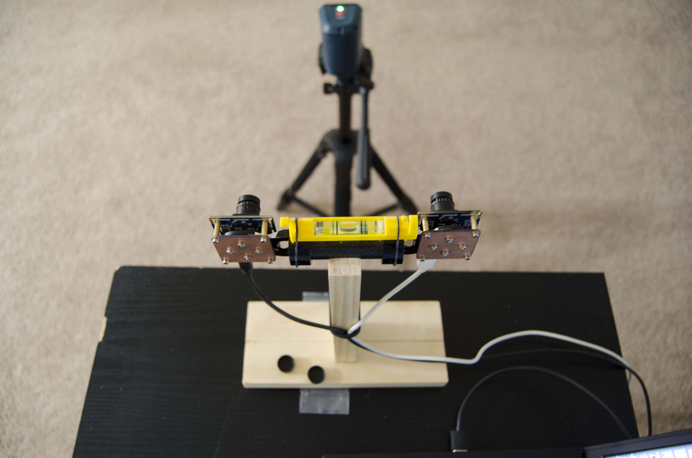
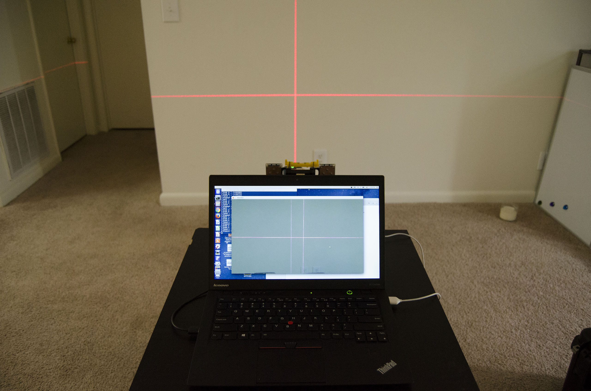

# STEREO VISION CAMERA HARDWARE ALIGNMENT
## 1. DESCRIPTON
The optical axes orientation of stereo vision cameras are determined by three factors: pitch, yaw, and roll, which are borrowed from aircraft principal axes. An aircraft in flight is free to rotate in three dimensions: pitch, nose up or down about an axis running from wing to wing; yaw, nose left or right about an axis running up and down; and roll, rotation about an axis running from nose to tail(see figure 1).(from wiki). The optical axis has the same orientation with the nose to tail direction of an aircraft. The stereo matching algorithm requires the two optical axes of the two cameras to be exactly parallel. In other words, the optical axes of two cameras should have the same pitch, yaw, and roll. In Fig 2, the two red solid lines are optical axes.

## 2. PROCEDURE
### 1) The Design of Camera Mount
A carbon fiber mount is designed to allow the cameras to have three dimension freedom of degree on yaw, roll, and pitch axes. You can adjust the bolts and caps to align the optical axes of the two cameras.

### 2) Alignment with the Help of Cross Laser
A cross laser is used to help to align the stereo cameras. A cross laser which projects two perpendicularly intersecting lines (left), and the cross laser image is captured by two cameras (right). The two images are superimposed to be displayed in one window.

  

Before calibration, keep the cameras level as shown in the following figure. If the cameras are not even, the accuracy of 3D positioning will be reduced.

  

Watch the display and adjust the pitch, yaw, and roll of each camera. Make the horizontal laser lines of the two images exactly overlapped. See following figures.

  

Once the optical axes of the two cameras are well aligned, you will see in the display window that the two horizontal laser line captured by two cameras are exactly overlapped, and the two perpendicular laser line captured by two cameras are parallel. The following figure shows the mis-aligned (left) and in-aligned optical (right) axes.

  

